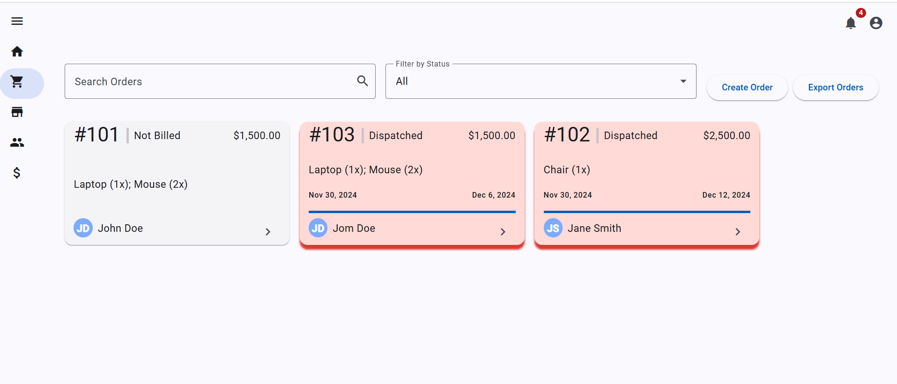
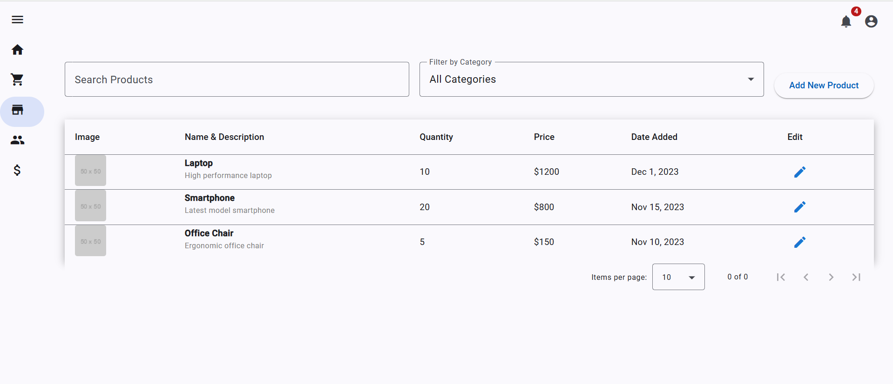

# **Order Management System Portal**

## **Overview**
This is a comprehensive full-stack application designed to demonstrate expertise in **.NET Core**, **Entity Framework**, **SignalR**, **SQLite**, and **Angular with Angular Material**. It features advanced data visualization with **D3.js** and **NGX-Charts**, offering real-time insights into revenue, orders, sales, and inventory management.

---

## **Key Features**

### **1. Data Analytics Dashboard**
- **Charts and KPIs** powered by **D3.js** and **NGX-Charts** for real-time insights:
  - **Monthly KPIs:**
    - Total orders, revenue, active users, and low stock items.
  - **Revenue, Orders, and Sales:**
    - Visualize revenue and sales trends for the current month.
  - **Monthly Order Fulfillment:**
    - Analyze order fulfillment trends over time.
  - **Sales & User Activity:**
    - Combined line and bar charts to showcase user engagement and sales performance.

> **Description:** Visualize key performance indicators and trends using D3.js and NGX-Charts.

### **2. Real-Time Order Tracking**
- Dashboard to track orders realtime

> **Description:** All orders can be tracked and can be filtered based on products, username, orderstatuses.

### **3. Order Creation and Summary**
- Adjust product quantities in the order dynamically using `+` and `-` buttons.
- Transition to the **Order Summary Page** for final review of selected items.
- Implemented **SignalR** for real-time updates.
- Review and adjust order quantities.
- Confirm or cancel orders with state preservation for revisions.

> **Description:** Adjust product quantities using `+` and `-` buttons. Navigate to the summary page to finalize the order.

> **Description:** Review your order with live updates before confirmation.

### **4. Inventory Management**
- **Product Management:**
  - Add, update, and manage products with attributes such as name, description, price, stock, weight, size, and images.
- **Search and Filter:**
  - Search by product name or filter by category.
- **Responsive Table:**
  - Paginated and sortable Angular Material table for seamless navigation.
- **Backend Integration:**
  - CRUD operations handled via RESTful APIs built with **.NET Core**.

> **Description:** View all products in the inventory, search by name, filter by category, and edit product details.

> **Description:** Add a new product with details such as name, description, category, price, stock, weight, size, and up to 5 images.

---

## **Solution Structure**

The **OrderManagement.sln** solution is organized using the **clean architecture** principles, ensuring modularity and maintainability.

### **1. API**
- Exposes RESTful endpoints for frontend integration.
- Handles routing, middleware, and controllers for order and inventory management.

### **2. Domain**
- Defines core business entities such as `Product` and `Order`.
- Encapsulates domain logic and rules.

### **3. Infrastructure**
- Manages database connectivity using **Entity Framework Core**.
- Contains SQLite migrations, repositories, and database context classes.

### **4. Services**
- Contains the core application logic for:
  - Order processing.
  - Inventory updates.
  - Real-time updates using **SignalR**.

### **5. Shared**
- Houses shared utility classes, constants, and common exceptions.

---

## **Technology Highlights**

### **Backend**
- **.NET Core Web API**:
  - Exposes endpoints for inventory and order management.
  - Implements middleware for error handling and request validation.
- **Entity Framework Core**:
  - ORM for SQLite with automated schema migrations.
- **SignalR**:
  - Enables real-time communication for order updates and notifications.

### **Frontend**
- **Angular 18**:
  - Module-based architecture for a responsive, single-page application (SPA).
- **Angular Material**:
  - Provides prebuilt UI components for tables, dialogs, forms, and dashboards.
- **Reactive Forms**:
  - Client-side validation and dynamic form control.
- **D3.js**:
  - Customized data visualizations for revenue, orders, and sales.
- **NGX-Charts**:
  - Prebuilt charts for user-friendly and interactive data analysis.

### **Database**
- **SQLite**:
  - Lightweight relational database for easy configuration and portability.
  - Handles schema migrations and queries seamlessly.

---

## **Setup Instructions**

### Prerequisites
- **Backend**:
  - .NET Core SDK
  - SQLite
- **Frontend**:
  - Node.js (v20 or higher)
  - Angular CLI

